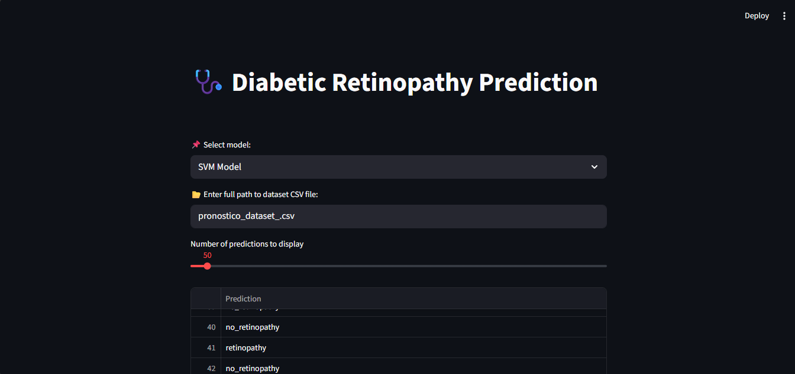

# -Diabetic-Retinopathy-Prediction

# 🩺 Diabetic Retinopathy Prediction

## 📌 Overview
This project predicts **Diabetic Retinopathy** in patients based on features such as **age**, **systolic blood pressure**, **diastolic blood pressure**, and **cholesterol** levels.  
It uses multiple machine learning models (SVM, Random Forest, Logistic Regression, KNN, Naive Bayes, XGBoost) and compares performance.

## 📸 Demo Screenshot

## 🚀 Features
- Multiple ML models trained using **scikit-learn/xgboost**
- Interactive **Streamlit** dashboard
- Predictions: `"retinopathy"` or `"no_retinopathy"`
- Model accuracy displayed (test set only)
- Option to **download predictions** as CSV
- Compare model performances

## 📂 Dataset
The project uses `pronostico_dataset_.csv`:
- **Features:** `age`, `systolic_bp`, `diastolic_bp`, `cholesterol`
- **Target:** `prognosis` (`retinopathy` / `no_retinopathy`)
- Separator: `;`

## 🖥️ Installation
Clone the repository:

